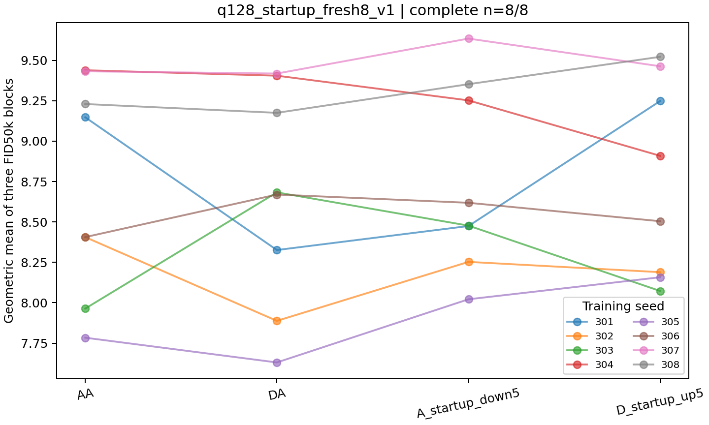
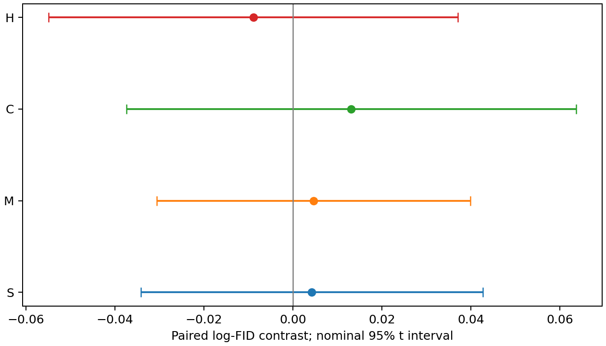

# q128 新八种子四臂：完整结果

这批预先固定的新种子中，没有观察到可靠的预设启动双向效应。主指标 **S=0.004235**，名义95%配对t区间 **[-0.034159, 0.042629]**，双侧 **p=0.801741**；8个种子中4个S为正、4个为负。不能据此宣称效应为零或已经等效。

## 数据与分析身份

- 新训练32/32完成；E_512、FP32、NFE1固定评估96/96块通过；四臂完整共同集合n=8，seeds301–308。
- AA、DA、A_startup_down5、D_startup_up5四臂均从各自种子的同一冻结初始化出发。前五次成功更新的临时LR操作按实际optimizer.step计数，AMP skip不推进窗口。
- 所有轨迹保持自己的完整状态，512 kimg时E_512从自己的online模型初始化一次，1024 kimg终点评估。
- 统计单位是训练种子。每臂Y=三个log-FID50k的均值；没有把生成块当作独立训练重复，也没有计算FID150k。
- 仅在完整组及全部新增ECT归档通过之后解盲。冻结科学实现fcc94d26b1085011ac935084f7c1cf4c149e2947，固定评估器d6aba02fb88e9db0993623895eb2228ed717d810。

## 预设结果

S=(C−M)/2，是log-FID复合对比；exp(S)是两个FID比值之比的平方根，不应解释成某个模型的FID改善百分比。

| 对比 | 平均log差 | 名义95%配对t区间 | 双侧p | M/C Holm p |
|---|---:|---|---:|---:|
| S（主要） | 0.004235 | [-0.034159, 0.042629] | 0.801741 | — |
| M：A_down−AA | 0.004645 | [-0.030614, 0.039903] | 0.764503 | 1.000000 |
| C：D_up−DA | 0.013114 | [-0.037362, 0.063590] | 0.558415 | 1.000000 |
| H：DA−AA（支持性） | -0.008912 | [-0.054840, 0.037016] | 0.660248 | — |

M对应FID比变化 **+0.47%**，区间[-3.02%, +4.07%]；C为 **+1.32%**，区间[-3.67%, +6.57%]；H为 **-0.89%**，区间[-5.34%, +3.77%]。M有3/8种子方向为改善，C有5/8方向为变差，H有6/8方向为改善；平均效应均未被区间解析。

S/M/C的全部256种符号翻转双侧敏感性p分别为0.765625、0.7578125、0.5546875。它们依赖符号对称假设，不是由臂随机分配产生的随机化检验。M/C的区间是名义区间，不是Holm同时置信区间。额外可用配对子表与完整共同集合一致，因为没有缺失臂。

## 与q256结果的关系

q256沿用PR111富集队列，延后/早期FID比1.11248，名义95%区间[1.04378, 1.18571]，双侧p=0.005504，8/8种子早期更低。因此现有证据支持该既有q256队列中的窗口位置现象，但本次q128新队列没有提供预期启动双向效应的复现证据。

两组同时改变了q和种子队列，且S与T是不同的预设对比。不能把两组百分比或“显著/不显著”的差异解释为q造成的因果交互；也不能据此识别唯一RAdam整流机制、唯一关键期或自然分母历史收益的中介比例。n=8的配对t推断有分布假设和有限精度，未做结果驱动的样本增补或窗口搜索。KID共用生成特征，仅作辅助。

## 执行偏差与完整性

正式32条轨迹和96块评估均通过，没有用其他结果替换正式轨迹。运行中一次主机许可错误额外启动了3条已转移任务的部分重复执行；发现后停止，依照事先确定的规范host归属排除，不使用其质量结果。全部错误日志、部分状态与审计单独归档到ECT，额外0.400088 GPUh纳入总账。本次“32条完成”指规范科学矩阵，不隐瞒额外执行。

执行位置因用户加卡而调整，包含不同A100显存规格；设备与版本有记录，但未将本轮作为跨硬件随机化验证。

逐块源文件SHA、32个终点身份和18份迁移完整归档已核验。`verification.json`使用独立SciPy单样本配对差检验接口重算均值、区间、p、Holm及符号翻转，全部与主分析一致；这属于数值复算，不是重新进行GPU训练。

文件：`statistics.json`、`blocks.csv`、`per_seed.csv`、`verification.json`、配对与效应图PNG/SVG。完整恢复大文件保存在ECT项目目录及归档目录中。
