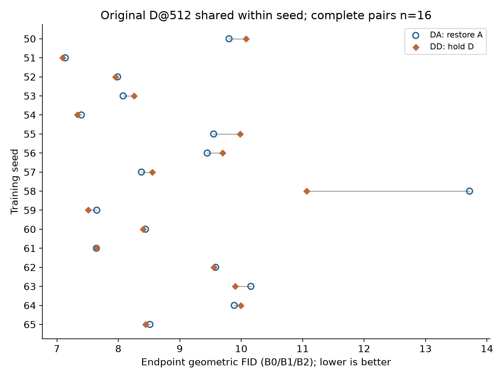
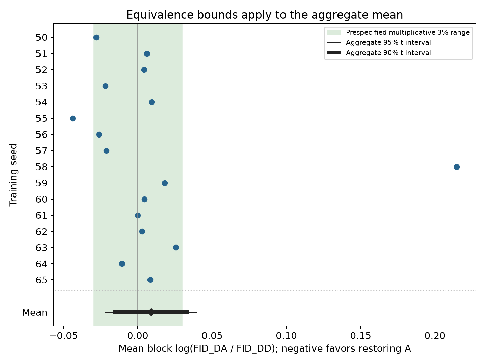
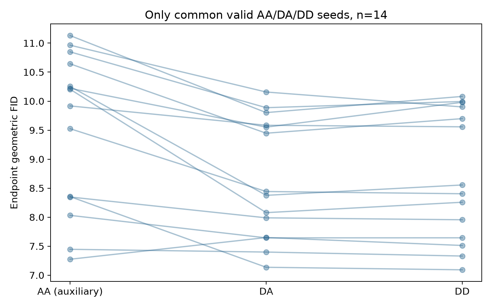

# D历史后恢复A与保持D：完整结果

计划16条DD后缀，16条成功、0条科学失败。唯一主比较使用完整有限配对 n=16，统计单位是training seed。

**DA/DD几何FID比为 1.008886，95%配对区间 [0.9781744, 1.040562]。** 几何比95%区间包含1，方向性证据不足。

## 证据与范围

- 实验：q256_d_restore_vs_hold_v1；每个DD仅从对应原完整D@512继续至1024，不重跑前缀。
- DA的80个原槽直接复用；AA仅作辅助，原缺失保留。seeds58、65始终属于DD主队列。
- 分析在DD正式训练前冻结；DA既有结果已经观察。本轮不是独立新seed复现。
- 正式实现源1740b9c，实际四节点部署28e9ffd；冻结FP32/NFE1 evaluator为d6aba02。结果报告commit不代表历史训练执行commit。

## 唯一主比较

每seed先对B0/B1/B2的log-FID作等权平均，形成DA减DD的配对差。负值表示恢复A有利，正值表示保持D有利。三个generation blocks是重复测量，不是三个training seeds。

| 项目 | 数值 |
|---|---:|
| 完整配对n | 16 |
| 平均log-FID差 DA−DD | 0.008846921 |
| seed SD（log差） | 0.05801543 |
| 双侧95% t区间 | [-0.02206732, 0.03976116] |
| 双侧p值 | 0.5510111 |
| 几何FID比 DA/DD | 1.008886 |
| 几何比95%区间 | [0.9781744, 1.040562] |
| 相对变化 | 0.888617% |
| 负/零/正方向seed数 | 7 / 0 / 9 |

全部逐seed值见per_seed.csv，全部原始FID/KID见metrics_160.csv。所有有限极端FID均保留，不插补缺失，不按成功更新数重加权。

## 预设乘法3%实用等效

边界为±log(1.03)，对应几何比范围[1/1.03, 1.03]，约[0.970874, 1.03]。以90% t区间严格落入边界作为TOST alpha=0.05的等效判断；方向判断与实用等效分别输出。

90% log差区间：[-0.01657907, 0.03427291]；TOST p=0.08688691。
完整配对集合中的实用等效未得到支持；不显著本身不证明相同。

该判断基于本轮全部16个成功配对。

## 16-seed全部成败

| seed | 旧DA | 新DD | 旧AA辅助 |
|---:|---|---|---|
| 50 | PASS | PASS | PASS |
| 51 | PASS | PASS | PASS |
| 52 | PASS | PASS | PASS |
| 53 | PASS | PASS | PASS |
| 54 | PASS | PASS | PASS |
| 55 | PASS | PASS | PASS |
| 56 | PASS | PASS | PASS |
| 57 | PASS | PASS | PASS |
| 58 | PASS | PASS | NO_ENDPOINT |
| 59 | PASS | PASS | PASS |
| 60 | PASS | PASS | PASS |
| 61 | PASS | PASS | PASS |
| 62 | PASS | PASS | PASS |
| 63 | PASS | PASS | PASS |
| 64 | PASS | PASS | PASS |
| 65 | PASS | PASS | NO_ENDPOINT |

## 绝对指标描述

下表先在seed内汇总固定blocks，再跨seed作描述性汇总；不把blocks当独立seed。全量逐槽FID/KID均保留在metrics_160.csv。

| 路径/读出 | n | FID算术均值 | FID几何均值 | KID原始均值 |
|---|---:|---:|---:|---:|
| DA/E_512 | 16 | 8.961682 | 8.84416 | 0.005491948 |
| DA/E_KEEP | 16 | 9.262113 | 9.155743 | 0.005756414 |
| DA/ONLINE | 16 | 9.731648 | 9.621441 | 0.006043376 |
| DD/E_512 | 16 | 8.842868 | 8.766261 | 0.005375277 |
| DD/E_KEEP | 16 | 9.145611 | 9.070741 | 0.005644528 |
| DD/ONLINE | 16 | 9.6048 | 9.505381 | 0.005926392 |

## AA辅助与次级读出

AA/DA/DD辅助比较只使用三路径共同有效集合 n=14：[50, 51, 52, 53, 54, 55, 56, 57, 59, 60, 61, 62, 63, 64]。不得拿16-seed DA/DD均值与14-seed AA均值直接拼接。辅助结果是描述性比较，不增加新的主要假设。

| 同一共同集合的辅助对比 | n | 平均log差 | 几何比 | 名义95%区间 |
|---|---:|---:|---:|---|
| DA-AA | 14 | -0.09152962 | 0.9125343 | [0.8733388, 0.9534889] |
| DD-AA | 14 | -0.08571384 | 0.9178569 | [0.8822935, 0.9548537] |
| DA-DD | 14 | -0.005815787 | 0.9942011 | [0.982875, 1.005658] |

E_KEEP与ONLINE均仅比较共同B0；E_512主读出使用固定三个block。KID复用相同features，按原始值汇总，不取log，也不作为独立复现。完整次级数值保存在statistics.json。







## 实施、核查与成本

独立DD协议与状态元数据明确current_arm=D、target1.0、denominator1.1。保留原模型/buffers、RAdam、GradScaler、RNG/sampler及全部训练时钟；E_KEEP保持，E_512从边界online初始化一次，resume不再初始化。正式训练始终使用原生D分母，未用scalar或LR替代。

原FP16+AMP、batch128/microbatch16/world_size1与全部原超参数保持。正常AMP skip保留，既不补样本也不对齐成功更新数；科学失败不救援或换seed。仅对1024终点做固定80槽评估，中间完整checkpoint保留。

B核查区分实数目标、浮点实现及LR关系；浮点loss/梯度/实际更新存在差异，未扩展完整scalar质量臂。工程结果与准确执行版本见../engineering/REPORT_ZH.md及source_provenance.json。

| 新增GPU进程成本 | GPUh |
|---|---:|
| DD训练 | 33.64651548 |
| 80槽评估 | 13.28085349 |
| 读出导出 | 0.1006003302 |
| 工程及其技术失败 | 0.4078171689 |
| 总计 | 47.43578647 |

以上为实际新进程墙钟GPUh；不计入复用前缀或旧DA的历史elapsed。租赁闲置、传输及账单口径另列，不能把GPU进程成本冒称实际租赁账单。80 GPUh进程上限与用户确认的200 GPUh剩余额度分开记录。

归档状态及逐文件来源见archive_index.json。复制完成与最终hash验证分开记录；大权重、生成图、features及私有连接不进入公开Git。

## 解释限制

本轮回答从已形成的D历史出发，512之后恢复A相对继续D对终点质量的影响。没有AD或多切点设计，不能识别早期唯一关键窗口、最佳切换点、history×current interaction或optimizer唯一中介，也不外推跨精度普遍性。

实用等效若成立，仅说明这项恢复操作的差异落在预设尺度内，不否定PR108的DA−AA历史效应。若有科学失败，有限FID推断条件于存活配对，全部16个结局同时报告。

## 离线复算

```bash
python -m analysis.q256_d_restore_vs_hold_v1.analyze --dd-slots analysis/q256_d_restore_vs_hold_v1/results/DD_80.json --output /tmp/dd-recomputed
python -m analysis.q256_d_restore_vs_hold_v1.render_figures --results analysis/q256_d_restore_vs_hold_v1/results
python -m unittest tests.test_d_restore tests.test_history_component tests.test_m1_training_state tests.test_history_component_evaluation
```

原数值环境与数据/脚本hash见验证记录。核心分析始终采用训练前冻结版本。
