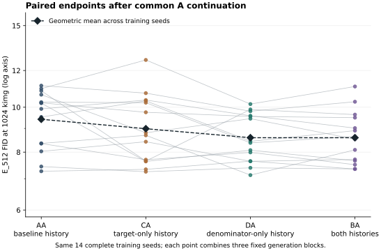
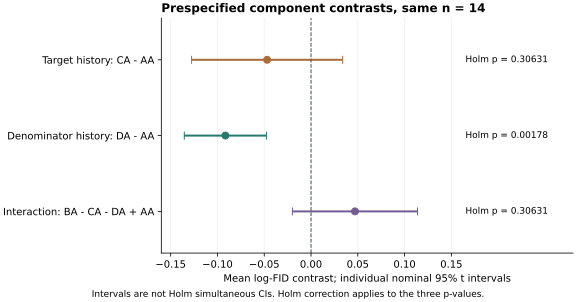

# 第一组结果：历史成分拆分与共同A续训

**主要结果：在基准target条件下，denominator-only前期历史降低终点FID的证据通过预定Holm校正。target-only和交互项均未通过校正，不能据此断言其无效。**

共同完整四路径集合为14个seed（50–57、59–64）。H_W的几何FID比为0.91253，即平均降低8.75%；逐项名义95%区间为0.87334–0.95349（下降4.65%–12.67%），Holm p=0.0017786。13/14个seed方向为下降。此结论限定于本CIFAR-10、q256、FP16+AMP和成功完整配对集合。

## 绝对质量与主成分对比

唯一主读出为1024-kimg、E_512、FP32/NFE1。每seed先对B0/B1/B2三个FID取log再平均，统计单位是训练seed。下表几何均值使用相同14组，不能与不同可用集合的原始FID算术均值混用。

| 路径 | 前期设置 | 同一14组几何均值FID | 相对AA |
|---|---|---:|---:|
| AA | target=1 / denominator=1 | 9.418214 | +0.00% |
| CA | target=1.1 / denominator=1 | 8.986598 | -4.58% |
| DA | target=1 / denominator=1.1 | 8.594443 | -8.75% |
| BA | target=1.1 / denominator=1.1 | 8.594982 | -8.74% |

三条主要对比均使用n=14、seed层双侧配对t检验，并对三项p值进行Holm校正（family alpha=0.05）。下列区间为逐项名义95% t区间，**不是Holm同时置信区间**。

| 对比 | 平均log差 | 样本SD | 名义95% CI | 原始p | Holm p | 负/正方向 |
|---|---:|---:|---|---:|---:|---:|
| H_T | -0.046911 | 0.139867 | [-0.127668, 0.033846] | 0.2315916 | 0.3063083 | 8/6 |
| H_W | -0.091530 | 0.076036 | [-0.135432, -0.047627] | 0.0005929 | 0.0017786 | 13/1 |
| I | 0.046974 | 0.115846 | [-0.019913, 0.113861] | 0.1531541 | 0.3063083 | 5/9 |

- H_T=CA−AA：基准denominator下的target历史效应。点估计下降4.58%，几何FID比名义区间0.88015–1.03443；当前数据仍容许约12.0%下降到3.44%上升，不能说target历史无效。
- H_W=DA−AA：基准target下的denominator历史效应。通过Holm校正。它不是对另一个factor平均后的主效应。
- I=BA−CA−DA+AA：交互点估计为正，但区间跨零、Holm p=0.30631，交互证据不足。指数化值1.04809是ratio-of-ratios，区间0.98028–1.12060，不是单臂质量改善百分比。





## 联合与次级结果

联合对比H_J=BA−AA与三项主对比使用完全相同14组。逐seed和均值均满足H_T+H_W+I=H_J；这只是代数恒等式，不是机制验证。以下结果是探索/描述性的，区间没有扩展多重校正，不替代主三项结论。

| 对比 | 平均log差 | 样本SD | 名义95% CI | 描述性原始p |
|---|---:|---:|---|---:|
| H_J | -0.091467 | 0.086113 | [-0.141187, -0.041746] | 0.0015872 |
| CA-DA | 0.044618 | 0.136057 | [-0.033938, 0.123175] | 0.2415668 |
| BA-CA | -0.044556 | 0.099854 | [-0.102210, 0.013098] | 0.1188967 |
| BA-DA | 0.000063 | 0.063497 | [-0.036600, 0.036725] | 0.9971076 |

CA−DA的直接对比区间跨零，因此“一个成分显著而另一个不显著”不证明两个成分效应不同。BA与DA平均FID很接近，但BA−DA不显著（p=0.99711）也不证明等效或“保留全部收益”；本轮没有设定等效性界限。

ONLINE/E_KEEP/E_512横向比较只使用共同B0，见[readout_B0.csv](readout_B0.csv)。所有KID对比先在seed内平均原始block值，不取log。KID与FID使用同一套features，不是独立复现。所有最大可用配对补充、逐seed值和区间完整保存在[secondary_statistics.json](secondary_statistics.json)，与共同S4分开。

## 所有启动路径、缺失与原始质量

新增32条：31条PASS；seed58/CA在attempt7592、971776张处理图像处因非有限loss科学终止，正常AMP语义下该步skip且update_norm=0。7576次成功更新、16次skip（含该失败步），未改变精度/LR、未重训、未补样本；其DA按计划成功完成。worker收尾记录中的checkpoint游标7111不是失败点。

复用原K：AA成功14/16，BA成功15/16；原缺失为58/AA、58/BA、65/AA。没有导入R/L/X或任何失败后的FP32敏感性修复。新增155个PASS槽、5个NO_ENDPOINT；旧145个PASS、15个缺失，合计320槽=300PASS+20NO_ENDPOINT，无预算/技术未决槽。

| seed | AA（旧K_A） | BA（旧K_B） | CA（新增） | DA（新增） | 进入S4 |
|---|---|---|---|---|---|
| 50 | PASS | PASS | PASS | PASS | 是 |
| 51 | PASS | PASS | PASS | PASS | 是 |
| 52 | PASS | PASS | PASS | PASS | 是 |
| 53 | PASS | PASS | PASS | PASS | 是 |
| 54 | PASS | PASS | PASS | PASS | 是 |
| 55 | PASS | PASS | PASS | PASS | 是 |
| 56 | PASS | PASS | PASS | PASS | 是 |
| 57 | PASS | PASS | PASS | PASS | 是 |
| 58 | 缺失（原K） | 缺失（原K） | 科学失败 | PASS | 否 |
| 59 | PASS | PASS | PASS | PASS | 是 |
| 60 | PASS | PASS | PASS | PASS | 是 |
| 61 | PASS | PASS | PASS | PASS | 是 |
| 62 | PASS | PASS | PASS | PASS | 是 |
| 63 | PASS | PASS | PASS | PASS | 是 |
| 64 | PASS | PASS | PASS | PASS | 是 |
| 65 | 缺失（原K） | PASS | PASS | PASS | 否 |

以下为每路径各自最大可用集合：先在每seed内对原始FID取算术均值，再报跨seed算术均值和SD。集合不同，不能用这些均值拼接主交互。完整FID/KID及全部readout见[absolute_quality.csv](absolute_quality.csv)，未剔除任何大但有限的FID。

| 路径 / E_512 | n | 原始FID算术均值 | SD |
|---|---:|---:|---:|
| AA | 14 | 9.512504 | 1.349109 |
| BA | 15 | 8.579623 | 1.157662 |
| CA | 15 | 9.118459 | 1.544068 |
| DA | 16 | 8.961682 | 1.599235 |

## 执行、成本与核验

前缀0–512kimg使用各自C/D历史，后缀512–1024统一A；保留自身optimizer、GradScaler、RNG/sampler与旧EMA，E_512只在512边界由online初始化一次。两个阶段都声明duration=1.024。正常AMP skip保留，不补样本、不对齐successful-step数。

原runtime：Python3.11.13、PyTorch2.6.0+cu124、CUDA12.4、cuDNN90100、NumPy2.1.2、SciPy1.16.1。训练FP16+AMP、batch128/microbatch16/world1、RAdam lr1e−4、dropout0.2、TF32=False；完整固定设置见上级执行协议与协议生成器。训练部署commit为47b8dca，源文件对应f6ac75a；冻结评估器为d6aba02。后续分配代码9e2c93b只增加固定job分区，不改训练或指标数学实现。

新增实际进程占用：训练127.563219 GPUh，短工程检查0.511364，评估23.716446，readout导出0.253596，合计**152.044625 GPUh**，低于200上限。全部新增轨迹合计255592 attempts、255185成功更新、407次skip，处理32715776张图像。见[cost_summary.json](cost_summary.json)、[training_stages.csv](training_stages.csv)、[training_trajectories.csv](training_trajectories.csv)。

计时来自本次进程启动到结束的外部记录；不累加checkpoint里继承的elapsed/gpu_hours_cumulative。租赁闲置、数据传输和平台计费未混入这些GPUh，也未取得平台账单，因此上述数字不是租赁账单。预算预测导致过调度暂停，均保留记录、调整未用额度后同任务继续；没有失败训练数值救援，新增155个有效评估均为attempt0。

32条正式前缀均有PASS配对回执：4000个attempt的batch/t/base_r字段逐步与旧A/B核对；见[formal_prefix_pairing.json](formal_prefix_pairing.json)。后缀启动前还强制检查512边界的RNG/sampler与旧A/B流一致。未记录的epsilon/dropout逐步指纹及全训练参数逐位复现不在该声明内。

五节点短GPU检查均PASS：A对旧基线不干预、prefix/suffix断点恢复精确、once-only EMA与keep optimizer、实际inner denoiser FP16、C/D factor映射和既有batch/t/base_r配对字段。检查只覆盖短程与已有telemetry，不声称未记录的epsilon/dropout逐步指纹或整个8000-attempt训练逐位复现。

最小测试：训练状态/协议检查22项通过，最终评估接口8项通过，发布结果独立核对3项通过（原runtime四新增节点也各通过8项）。旧M1 published-results精确JSON测试仍有15处末位浮点差异（最大4.44e−16），未修改旧数据或测试，不能称旧测试全通过；145个原指标与原receipt逐项一致。正式统计在原runtime执行，数据/代码可离线重算。

## 限制与交付边界

- 推断条件于完整成功四路径集合，S4=14；必须同时报告全部16seed的成败。不能把成功集合效应外推为未条件化的16seed平均处理效应。
- 复用已观察A/B对照，是预设成分研究，不是新的独立确认；Holm只处理本轮三项主对比的多重性。
- 配对t依赖seed差值的抽样分布假设，n=14的有限样本与区间宽度需保留解释余地；没有根据诊断改变集合、变换或检验。逐seed数据和配对图均公开，廉价leave-one-seed-out仅给均值范围，不择优报告或删seed。
- 不识别optimizer唯一存储、自然中介比例、等效、跨数据集普遍规律。更具体的数值、缺失与统计谬误核验见[VALIDATION.md](VALIDATION.md)。
- 本结果包不含checkpoint、生成图像、features、口令或私有服务器连接。原始证据的实际归档相对路径和SHA256见[archive_index.json](archive_index.json)。云端完整集中副本已checksum通过；ECT全量外传仍在进行，不能将实验统计COMPLETE等同于全部离线归档完成。

## 离线复核

从仓库根运行：

```bash
python -m analysis.q256_history_component_chase_v1.results.reproduce
python -m analysis.q256_history_component_chase_v1.results.render_figures
```

原runtime应重现保存的正式数值；其他SciPy版本允许1e−12量级算术容差并明确区分精确JSON一致。两个图只使用保存的统计/逐seed结果，不增加训练、生成block或质量扫描。
