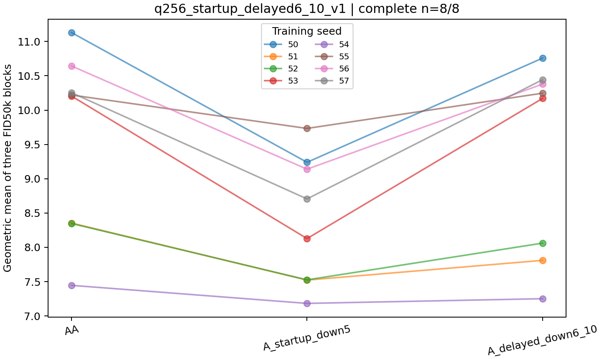
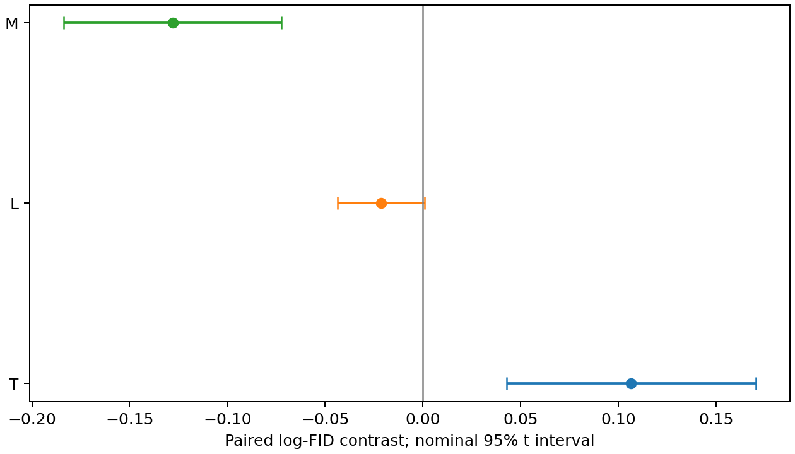
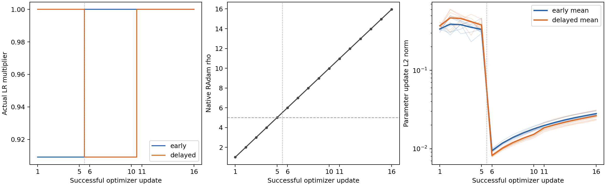

# q256 delayed startup window: complete eight-seed result

Moving the same five-successful-update LR reduction from updates 1–5 to updates 6–10 produced higher endpoint FID in all eight seeds of the existing PR111 responder-enriched cohort. The delayed/early geometric FID ratio is **1.11248** (nominal paired-t 95% CI **1.04378–1.18571**; two-sided **p=0.005504**). This is an exploratory within-cohort comparison, not independent fresh-seed confirmation.

[中文完整汇总](results/SUMMARY_ZH.md) · [Validation](VALIDATION.md) · [Statistics](results/statistics.json) · [Block-level data](results/blocks.csv) · [Costs](results/costs.json)



## Fixed design

- Eight new `A_delayed_down6_10` trajectories, seeds 50–57, fresh transfer to 1024 kimg / 8000 attempted iterations.
- Native q256 A loss throughout, batch 128, microbatch 16, world size 1; base RAdam LR 1e-4. Only successful optimizer updates 6–10 use LR/1.1. AMP skips do not advance this clock; base LR is restored afterward.
- Each trajectory retains its own complete optimizer/scaler/RNG/sampler state and initializes its own E_512 exactly once at 512 kimg.
- Eight endpoints and 24 new E_512, FP32, NFE1 FID50k/KID50k blocks all passed. Exactly 48 historical AA / early-window blocks are reused.
- The statistical unit is a training seed: Y is the mean of three log-FID50k values. The blocks are not 24 independent training replicates; no FID150k is computed.
- Primary direct window contrast T = Y_delayed − Y_early. L = Y_delayed − Y_AA is the exploratory secondary contrast. The reused early-vs-AA M is descriptive context. q128 results are not included or pooled.



L is −0.021305 (95% CI −0.043578 to 0.000967; p=0.058167). It does not resolve the direction of the delayed-vs-AA effect. T is based on a direct paired comparison, not on comparing whether two separate p-values cross .05. The exact enumeration over 256 sign patterns gives sensitivity p=0.0078125 under sign symmetry; this is not an arm-allocation randomization test. Auxiliary TOST at ±log(1.03) does not establish equivalence (p=0.987789).

The cohort was selected in earlier work. The result does not estimate an unselected seed-population effect, uniquely identify RAdam rectification or a unique critical period, establish a natural mediation proportion, or identify a causal q interaction. KID uses the same generated features and is auxiliary rather than independent replication.

## Reproduce and verify

With Python 3.11 and the frozen numerical versions:

```sh
python -m pip install numpy==2.1.2 scipy==1.16.1
python analysis/q256_startup_delayed6_10_v1/verify_results.py
```

The verifier checks the public-file SHA256 manifest; all 72 distinct blocks; all 24 new endpoint bindings; the exact published PR111 control values and their source hashes; eight complete 8000-attempt outcomes; own 512/1024 checkpoint seals; 16 immutable early/delayed telemetry prefixes; and independently recomputes per-seed Y/T/L/M, paired-t intervals, p-values, geometric ratios, all 256 sign flips and TOST. Numerical reproduction is from the committed outputs, not a new GPU training run. GitHub Actions runs the same check for this PR.

The training implementation is frozen at `fcc94d26b1085011ac935084f7c1cf4c149e2947`, a descendant of PR111 head `e429ab29476b23c4417cc2b1df7268a2b192f175`. The evaluator is pinned to `d6aba02fb88e9db0993623895eb2228ed717d810`. Shared startup-window code also supports the separately running fresh q128 experiment; no q128 quality claim is made here. Original seed-specific commands, manifests, outcomes and evaluation receipts are under `results/evidence/`, with infrastructure paths replaced by explicit placeholders.

`RAW_PROVENANCE.json` preserves the SHA256 of each raw receipt before redaction; `PUBLIC_SHA256.json` covers the separate public representations. Large checkpoints, feature/sample arrays and original logs remain in verified storage; their archive indices and hashes are included. Credentials, private absolute paths and physical GPU UUIDs are excluded. Placeholder paths in execution records must be resolved to the reader's own assets and a new immutable output location before a new execution.

The eight new delayed trajectories and endpoint evaluations used **38.619616 process GPUh**: paid 25.140100 and owned 13.479516. Shared engineering/preparation and the q128 experiment are separate; rental idle capacity is not process GPUh. Seeds 56/57 hit a GPU-exclusivity exception after training and before evaluation. The original endpoints and exception audit were preserved and only the unexecuted empty B0 directories were cleaned after GPU contention cleared; no trajectory was retrained.

## Update exposure diagnostics



The diagnostic table preserves attempted and successful clocks, AMP skips, LR restoration, RAdam rho/branch and update norms. An identical count of five successful LR-modified updates does not imply identical realized update exposure. Historical early logs lack the vectors needed for net displacement; missing values are retained instead of inferred from scalar norms.
