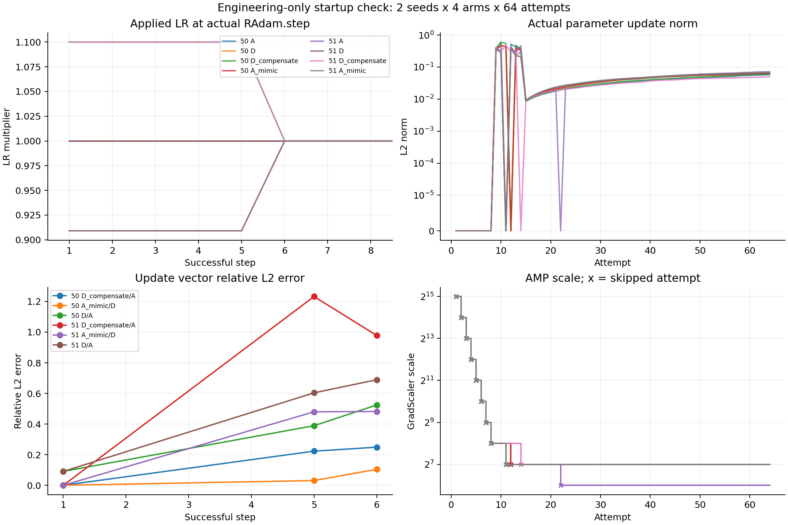

# ECT / RAdam 启动更新工程短检查（非质量实验）

本轮完成固定的 seeds50/51 × A、D、D_compensate、A_mimic ×64 attempted updates，合计512次尝试、439次成功更新、73次AMP跳过。八个训练进程全部正常结束，没有失败科学轨迹、技术重跑、追加种子或延长训练。没有计算FID。首个共同成功更新的补偿/复现范数比接近1，向量相对误差约0.020%–0.024%；第5/6成功步已分叉，AMP时序也出现臂间差异。

## 实现、配置与可追溯性

基线：PR109 `092ab9ab54e3f2dd780654b752bf85643d92af59`。独立分支：`codex/q256-startup-update-check-v1`。实际GPU执行代码为 `4198387b514fedbe43574452b18e021923a1de58`，实现patch SHA256为 `826f3ed0215e885a6a433e822b76478212a5ba788cca888a39e7e40e15c8982c`。后续交付提交只增加离线核验入口、报告及结果，不改变已执行轨迹。

运行前的固定协议、完整八条命令、展开的原生参数、资产与初始回执哈希、环境和源文件哈希已冻结在服务器control目录。数值命中阈值为null：本轮预先选择报告连续的范数比、余弦与相对L2误差，没有事后制定通过阈值。工程断言与数值接近程度分别报告。

保持原CIFAR-10/ddpmpp/ECT、q256、sigmoid/k8/b1/c0/double10000、batch128/microbatch16/world_size1、dropout0.2、augment0、xflip=False、FP16+AMP、TF32=False及原EMA（beta0.9993）。八个microbatch各自loss.mean().backward()，不额外除以8。duration=1.024对应1024kimg；工程暂停在64次尝试、8192张已消耗样本处发生。原生A/D损失实现未改动。

使用原transfer、seed和配置重建起点。每个seed四臂的model、EMA、optimizer、GradScaler、RNG/sampler哈希一致，且逐项通过原initial receipt核验；没有从512状态重置。配置比较只容许预定loss factors和文件路径差别。原始ZIP及权重均通过指定SHA256；详情见 [资产及初始化清单](asset_and_initialization_manifest.json)。

安装环境的核心版本全部符合要求。原环境归档缺失部分依赖，通过原部署回执补齐；NVIDIA驱动和部分辅助依赖存在明确记录的差别，未宣称完整环境逐包相同。见 [环境准备记录](ENVIRONMENT_NOTES_ZH.md)、[环境快照](environment.json) 与 [pip导出](pip-freeze.txt)。原launch_receipt权限受限，因此用可读配置、launcher日志、原部署记录和仓库命令构造交叉核对。两个A臂各64次尝试的14个遥测字段均与原始记录精确一致，见 [原A复现](original_A_replay.json)；这不是对所有参数张量逐位一致的替代证明。

## 工程核验

对实际安装的torch.optim.RAdam源码核对：rho_t > 5进入rectification；beta2=0.999时rho_5=4.995998000395048，rho_6=5.994163751655833。原源码SHA256为 `a094af74aff4ae21354d3f9cc6cf9e155323dac89bb7c02d2f846e11f63f560c`，完整文本保存在control。按每个活跃参数内部step+1计算阶段，仅在真实optimizer.step内部临时改变LR，finally恢复。D_compensate成功步1–5为1.1e-4；A_mimic为1e-4/1.1；成功步6起均为1e-4。AMP skip没有进入该调用，也没有推进内部时钟。

相关23项CPU测试全部通过，包含原生RAdam、真实CPU GradScaler、正常/异常LR恢复、第五/六成功步边界、梯度与moments没有被干预直接修改、诊断不消耗RNG、时钟不一致拒绝、旧16-step和正式协议守卫。测试日志见 [CPU测试](cpu-tests.log)。原loss/history/repro及PR109工程入口的源文件哈希保持不变，见 [原生源文件核验](unchanged_native_sources.json)。新入口拒绝其他seed、其他长度、缩短总计划、512恢复状态和无工程身份的调用，工程checkpoint也拒绝作为正式训练恢复源。

512条attempt记录和八份完整checkpoint独立核验通过。各运行内全部参数时钟一致，计数与真实成功调用相符；最终LR均为1e-4。所有记录的loss、实际更新、model和EMA均有限。AMP事件中的原始梯度非有限值被记录并由原生GradScaler处理。没有诊断额外forward/backward，没有强制各臂skip相同。控制台tick0的“loss nan”来自原日志collector首次update之前的空统计值；不能据此认定本轮逐attempt loss非有限，后者的实际计数全为0。

## 八个运行的完整状态

|Seed|Arm|状态|尝试|成功|Skip|GPU进程秒|GPUh|
|---|---|---|---:|---:|---:|---:|---:|
|50|A|COMPLETED|64|55|9|122.880571|0.034133492|
|50|D|COMPLETED|64|55|9|123.782930|0.034384147|
|50|D_compensate|COMPLETED|64|55|9|125.285523|0.034801534|
|50|A_mimic|COMPLETED|64|55|9|123.378594|0.034271832|
|51|A|COMPLETED|64|54|10|124.391079|0.034553078|
|51|D|COMPLETED|64|55|9|123.129597|0.034202666|
|51|D_compensate|COMPLETED|64|55|9|123.836065|0.034398907|
|51|A_mimic|COMPLETED|64|55|9|123.085139|0.034190316|

失败项0，未运行项0。逐进程开始/结束UTC、PID、退出码、1200秒硬超时和命令见 [GPU账本](archive_receipts/gpu_ledger.json)。累计GPU进程成本 **0.2749359719434546 GPUh（989.769499秒）**，使用单张A100，低于3GPUh上限。该账本保守计入训练进程组的完整墙钟时间（包括初始化）；CPU环境准备、复制、分析和实例闲置不冒充GPU进程成本。实例租用计费时间包含这些非GPU运行时段；没有账单数据，无法给出金额或精确租赁时长。释放操作另存回执，未扩充本轮计算预算。

## 更新向量结果

以下范数比均为candidate/reference，余弦为两实际更新向量夹角余弦，相对误差为||candidate-reference||/||reference||。使用保存的真实参数更新向量，在CPU float64中累加；没有用梯度或理想更新替换真实更新。零向量的余弦/相对误差标为N/A，不补分母。完整数据还包含更新前参数、梯度及绝对误差，见 [比较JSON](comparisons.json) 和 [CSV](key_updates.csv)。

第一次共同成功更新均发生在attempt9。此前八次均被AMP跳过，比较双方的更新前参数完全相同、batch/t/base_r及RNG哈希相同；这是本轮最接近同状态局部代数检验的观察点。

|Seed|比较|成功步|Candidate/Reference attempt|更新范数比|更新余弦|相对L2误差|更新前参数L2差|
|---|---|---:|---|---:|---:|---:|---:|
|50|D_compensate/A|1|9/9|0.99998268|0.99999997|0.00023168|0|
|50|D_compensate/A|5|14/14|0.98455870|0.97483676|0.22313181|0.14543938|
|50|D_compensate/A|6|15/15|1.00112528|0.96905829|0.24890627|0.17607188|
|50|A_mimic/D|1|9/9|1.00001724|0.99999997|0.00023452|0|
|50|A_mimic/D|5|14/14|0.99957000|0.99951334|0.03119419|0.018606215|
|50|A_mimic/D|6|15/15|1.00622805|0.99460131|0.10441940|0.024859947|
|50|D/A|1|9/9|0.90907518|0.99999990|0.09092581|0|
|50|D/A|5|14/14|0.93473285|0.92124221|0.38922330|0.41736866|
|50|D/A|6|15/15|1.06275992|0.87245579|0.52443927|0.52741337|
|51|D_compensate/A|1|9/9|0.99996820|0.99999998|0.00019510|0|
|51|D_compensate/A|5|13/14|0.62944017|-0.09711839|1.23225620|0.2856432|
|51|D_compensate/A|6|15/15|1.02597382|0.53380542|0.97840764|0.47378422|
|51|A_mimic/D|1|9/9|1.00003167|0.99999998|0.00019740|0|
|51|A_mimic/D|5|14/14|1.37726250|0.96807320|0.47986473|0.039091025|
|51|A_mimic/D|6|15/15|0.98289162|0.88191849|0.48209476|0.071341319|
|51|D/A|1|9/9|0.90906211|0.99999992|0.09093866|0|
|51|D/A|5|14/14|0.46445578|0.91633108|0.60376207|0.15027296|
|51|D/A|6|15/15|1.03612015|0.77150414|0.68905951|0.24112909|

成功步5和6均已存在非零参数状态差，不能要求逐位一致。seed51 D_compensate/A在成功步5分别使用attempt13/14，连batch和随机输入也不同，尤其不能当作同状态反事实。即使同一attempt且内部时钟暂时重新相等，此前的skip和状态历史也可能不同。

## AMP、时钟及随机流

|Seed|Arm|Skip attempts|
|---|---|---|
|50|A|1, 2, 3, 4, 5, 6, 7, 8, 11|
|50|D|1, 2, 3, 4, 5, 6, 7, 8, 12|
|50|D_compensate|1, 2, 3, 4, 5, 6, 7, 8, 12|
|50|A_mimic|1, 2, 3, 4, 5, 6, 7, 8, 12|
|51|A|1, 2, 3, 4, 5, 6, 7, 8, 11, 22|
|51|D|1, 2, 3, 4, 5, 6, 7, 8, 11|
|51|D_compensate|1, 2, 3, 4, 5, 6, 7, 8, 14|
|51|A_mimic|1, 2, 3, 4, 5, 6, 7, 8, 11|

同一attempt的batch/t/base_r、前后RNG核对，以及skip/内部时钟是否匹配，保存在 [同attempt比较](same_attempt_norm_ratios.json)。每对64次的差异次数如下；这里“时钟不同”指臂之间，不是单个运行内部参数时钟不一致。

|Seed|比较|随机字段不同次数|Skip事件不同次数|跨臂时钟不同次数|
|---|---|---:|---:|---:|
|50|D_compensate/A|0|2|1|
|50|A_mimic/D|0|0|0|
|50|D/A|0|2|1|
|51|D_compensate/A|0|3|46|
|51|A_mimic/D|0|0|0|
|51|D/A|0|1|43|

没有补样本或补成功更新，所有运行仍消费同一seed对应的64个batch。seed50 A与其余臂在attempt11/12的skip位置不同；seed51 D_compensate在attempt14 skip，A/D/A_mimic在attempt11 skip，A另在attempt22 skip。AMP时序已参与后续轨迹分叉，应纳入解释，不能将整个64步差异归结为单一更新尺度。



图中LR横轴为成功步，更新范数和AMP横轴为attempt；叉号为skip。左下图按成功步配对，包含上述不同attempt或已分叉状态的比较，连线只辅助读数，不表示同状态误差随时间演化。PDF版本：[科学图表](startup_diagnostics.pdf)。

## 数据保管与离线复算

持久化目录：`/mnt/q256_startup_update_check_v1_20260909`。`runs/seed{50,51}-{A,D,D_compensate,A_mimic}/`保存原始训练日志、逐attempt JSONL、真实step调用回执、参数顺序/形状、successful1/5/6的pre-parameters/finite-gradients/update张量和完整终态。每个训练输出从容器本地目录复制到持久化网盘后逐文件SHA256一致，才启动下一运行。八份 [归档回执](archive_receipts) 列出全部运行文件哈希。Git只保存代码、脱敏摘要、图表和哈希清单，不含大权重/诊断张量。

在仓库根、记录的环境中执行：

```bash
CUDA_VISIBLE_DEVICES='' python -m analysis.q256_startup_update_check_v1.verify_results --root /mnt/q256_startup_update_check_v1_20260909
CUDA_VISIBLE_DEVICES='' python -m analysis.q256_startup_update_check_v1.analyze --root /mnt/q256_startup_update_check_v1_20260909 --output /tmp/startup-analysis
```

两个入口只做CPU离线核验，不运行训练。原始receipt和历史A CSV在receipts/provenance中；control保存冻结协议、八条命令、环境、实现patch、预算账本和技术失败日志。环境准备及一次CPU后处理导入失败已修复，未重跑科学轨迹，详见环境记录。

## 对四个问题的回答

1. **干预是否正确实现？是，在本轮限定协议和实测路径内通过核验。** 23项CPU测试及512条GPU记录支持真实step中的阶段判定、skip不计成功、LR恢复、原生损失/累积/随机流保留；第5/6成功步边界无off-by-one，单运行内部没有参数时钟不一致。
2. **局部更新是否符合预测？首个共同成功更新符合。** 两seed的D/A范数比分别为0.90907518、0.90906211；D_compensate/A为0.99998268、0.99996820，A_mimic/D为1.00001724、1.00003167。两种干预配对的向量相对L2误差为0.01951%–0.02345%，余弦均大于0.99999997。生产浮点下没有逐位相等；没有事后数值通过阈值。这支持已知RAdam非自适应阶段的局部尺度预测，不构成新的优化器性质发现。
3. **是否存在阻碍解释的AMP、时钟或数值问题？有跨臂AMP时序和后续状态分叉，但没有发现工程时钟错误或非有限参数更新。** 第5/6成功步的相对误差可达0.223/0.249（seed50 D_compensate/A）和1.232/0.978（seed51），其中seed51第5步还是不同batch。即使A_mimic/D的skip和时钟始终匹配，seed51第5/6步相对误差也约0.480/0.482；小的初始浮点差异及随后动力学不能被忽略。不能声称补偿或复现了完整早期轨迹。
4. **是否值得进行下一阶段终点质量实验？值得考虑一项另行预注册、另行授权的质量实验，但问题应是“这一完整启动干预是否影响终点质量”，包含原生AMP带来的间接作用。** 依据是干预实现可靠且首步预测获得直接验证；继续实验才可能测量质量效果。由于早期已分叉，当前证据不足以把该干预当作纯粹、隔离的机制检验。下一阶段应预定终点指标、种子、预算与AMP诊断，不依据本轮两seed短程误差选择有利设置。本轮没有执行或授权扩展质量训练，也没有证明启动差异导致已观察的FID收益。
