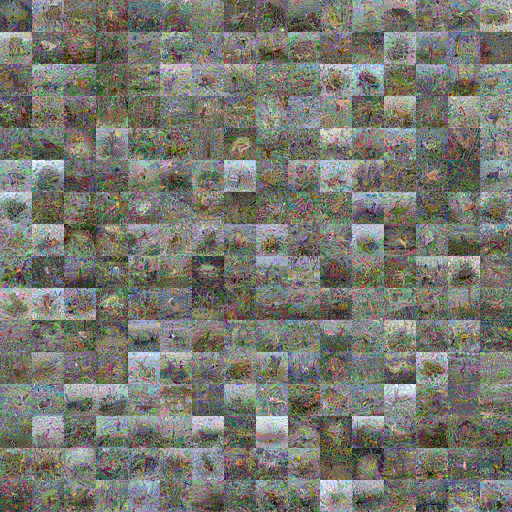
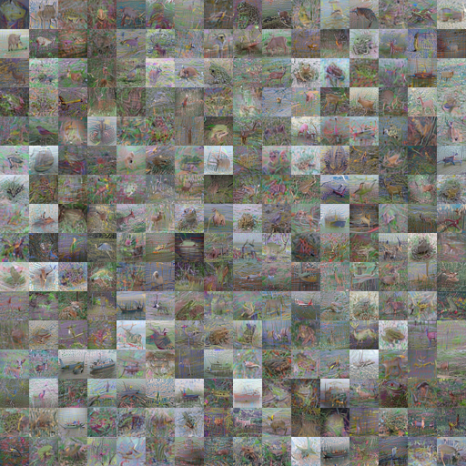
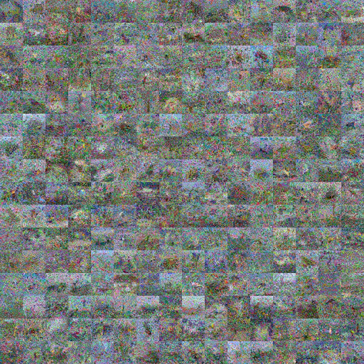
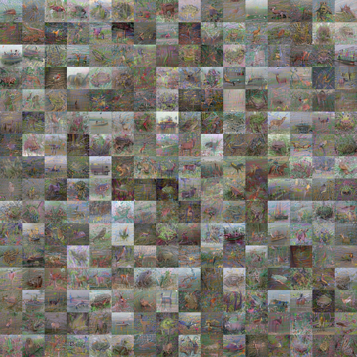
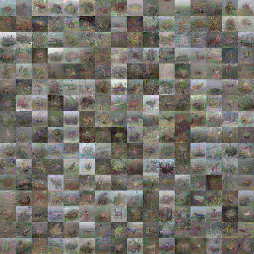
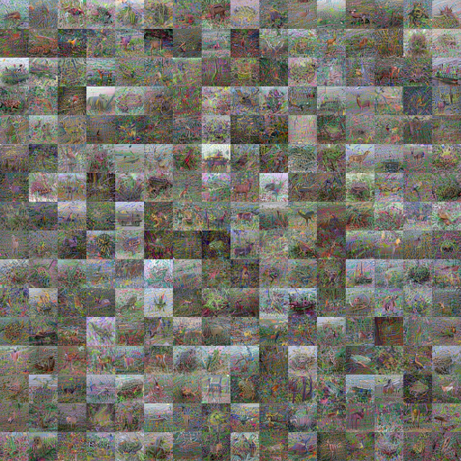

# q256 seed3/4 interim training summary

## Material Passport

- Origin Skill: experiment-agent
- Origin Mode: validate
- Origin Date: 2026-08-20
- Verification Status: ANALYZED
- Version Label: q256_seed3_seed4_interim_v1

## Scope and boundary

This is a descriptive snapshot of the eight completed seed3/4 training cells at source commit `dcca41b19e7c45512b5fbe98776520396a1bf9ac`. It is not the frozen formal evaluation. Training used `--metrics=none`; therefore FID-50k@NFE=1, KID, preregistered quality contrasts, the factorial interaction, and a final arm ranking are not yet available.

The independent unit is the training seed. This snapshot contains only two of the three preregistered seeds and must not be treated as `n=8`.

## Arms

| Arm | Target geometry | Loss denominator | Interpretation |
|---|---:|---:|---|
| A | g=1.00 | g=1.00 | native baseline |
| B | g=1.10 | g=1.10 | native g=1.10 |
| C | g=1.10 | g=1.00 | target-geometry-only |
| D | g=1.00 | g=1.10 | loss-weighting-only |

## Completed endpoints

| Seed | Arm | Attempts | Accepted | kimg | AMP skips | Final-row loss | Last-200 loss mean ± SD |
|---:|---:|---:|---:|---:|---:|---:|---:|
| 3 | A | 2000 | 1990 | 256.000 | 10 | 16.8809 | 16.2441 ± 1.1089 |
| 3 | B | 2000 | 1990 | 256.000 | 10 | 16.5293 | 16.2132 ± 1.0917 |
| 3 | C | 2000 | 1990 | 256.000 | 10 | 18.2958 | 17.7549 ± 1.2112 |
| 3 | D | 2000 | 1990 | 256.000 | 10 | 15.3652 | 14.8095 ± 1.0194 |
| 4 | A | 2000 | 1990 | 256.000 | 10 | 16.6557 | 16.5775 ± 1.1219 |
| 4 | B | 2000 | 1991 | 256.000 | 9 | 16.6892 | 16.4439 ± 1.0801 |
| 4 | C | 2000 | 1990 | 256.000 | 10 | 18.2939 | 18.0839 ± 1.2284 |
| 4 | D | 2000 | 1990 | 256.000 | 10 | 15.2756 | 15.0311 ± 1.0146 |

Across the two available seeds, the mean last-200 loss was A=16.4108, B=16.3285, C=17.9194, and D=14.9203. This ordering is a training-objective diagnostic only. Because the arms deliberately change target geometry and/or the realized per-sample denominator, scalar losses across all four arms are not a common quality scale.

Within equal-denominator pairs, the target-geometry change increased the last-200 raw objective by 1.5108 (seed3) and 1.5064 (seed4) for C−A, and by 1.4037 (seed3) and 1.4128 (seed4) for B−D. This is a consistent optimization diagnostic, not evidence that target geometry improves or degrades FID.

## Training integrity

- All eight cells reached exactly 2000 attempts and 256.000 kimg.
- Seven cells had 1990 accepted updates. Seed4/B had 1991; its one-update difference remains an endpoint-analysis covariate.
- Loss, sanitized-gradient, update, model, EMA, factorial, and denominator non-finite counts were all zero.
- Every raw-gradient non-finite row corresponded exactly to an AMP-skipped step; mismatch count was zero in all cells.
- Nonpositive realized denominators: zero in all cells.
- The per-attempt telemetry identities were exact for A/D same target, B/C same target, A/C same denominator, and B/D same denominator in both seeds.

## Exploratory fixed-grid read

The fixed preview grids are not the preregistered quality endpoint. Seed3 visually showed clearer recognizable structure in B and D than in A and C. Seed4 showed much smaller A/B/C differences, with D somewhat noisier. The visual pattern therefore does not establish a stable factorial mechanism across the two available seeds. No scheduling, checkpoint, or arm-selection decision was made from these grids.

### Seed 3

| A | B | C | D |
|---|---|---|---|
|  |  |  |  |

### Seed 4

| A | B | C | D |
|---|---|---|---|
|  |  |  |  |

## Statistical interpretation

Overall confidence is **CAUTION**: training completion and numerical stability are established for seed3/4, but only two of three independent seeds are available and none of the frozen external quality endpoints has been evaluated. No p-values or confidence intervals are appropriate at this stage, and minibatches or preview images do not increase the independent sample size.

### Fallacy scan

Coverage: **11/11**.

| Fallacy | Status | Interim assessment |
|---|---|---|
| Simpson's paradox | NOTE | Seed-level values are retained; no pooled direction is substituted for them. |
| Ecological fallacy | N/A | No group-to-individual inference is made. |
| Berkson's paradox | N/A | Cells were not selected using their observed outcome. |
| Collider bias | N/A | No post-treatment covariate adjustment is used. |
| Base-rate neglect | N/A | This is not a diagnostic-classification analysis. |
| Regression to the mean | N/A | Seeds were not selected for extreme prior outcomes. |
| Survivorship bias | CAUTION | This is explicitly an interim two-seed snapshot; it cannot replace the complete three-seed matrix. |
| Look-elsewhere effect | CAUTION | Preview-grid observations are exploratory and cannot replace frozen FID/KID endpoints. |
| Garden of forking paths | NOTE | The preregistered endpoints and contrasts remain frozen and unevaluated. |
| Correlation versus causation | CAUTION | Training diagnostics alone do not establish a causal quality mechanism. |
| Reverse causality | N/A | No observational directional claim is made. |

## Reproducibility status

- Method: existing deterministic compact-resume evidence plus exact telemetry identity checks; no new rerun was performed for this interim summary.
- Verdict: training semantics are internally consistent, but the interim quality result is **CANNOT_VERIFY** until seed5 and the frozen evaluation complete.
- Machine-readable values and artifact hashes: `summary.json`.
- Tabular endpoint snapshot: `summary.csv`.

