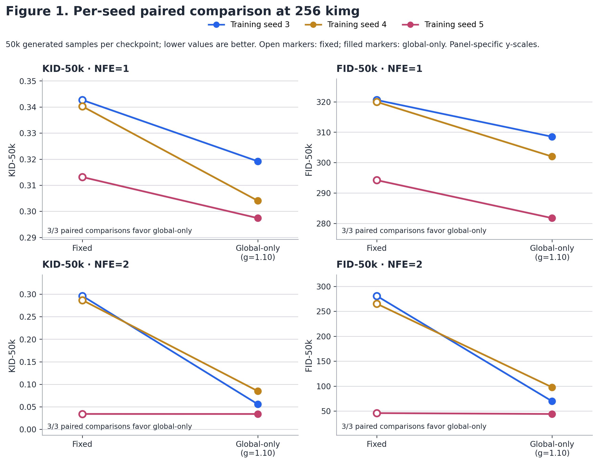
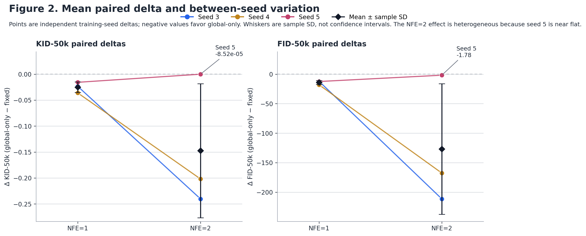

# q=256 confirmatory formal results

This package is the completed, predeclared three-seed (3/4/5) fixed-sigmoid versus global-only-sigmoid (`g=1.10`) q=256 comparison. It contains all 24 formal metric records: 6 checkpoints × 2 NFE modes × 2 metrics. Both KID-50k and FID-50k are lower-is-better.

All evaluations used 50,000 generated samples (seeds `0-49999`), metric seed `20260730`, and FP32. The evaluator commit is `8375d46ca4c65e85ab399fcf1effe22ebb766790`; the dataset SHA-256 is `9fd64620e37bfc0c995535fa52701c9641bcd07635008bfda0c9fbddde1a4ed6`. Full portable runtime and checkpoint provenance is in `environment_manifest.json`.

## Package contents

| File | Purpose |
| --- | --- |
| `evaluation_results.csv` | 24 long-form absolute metric records, including checkpoint IDs and SHA-256s. `run_id` is a portable logical identifier. |
| `paired_differences.csv` | 12 seed-level global-only minus fixed differences, with absolute values, relative improvements, and checkpoint provenance. |
| `paired_statistics.json` | Machine-readable paired descriptive, robustness, and NFE-heterogeneity summaries derived from the difference CSV. |
| `paired_statistics.md` | Reader-facing paired robustness table, leave-one-seed-out summary, and NFE-heterogeneity table. |
| `figures/` | Reproducible SVG, PNG, and PDF main-text figures. |
| `environment_manifest.json` | Frozen evaluator environment, data identity, NFE settings, and six checkpoint identities without machine paths. |

## Per-seed absolute values

| Metric | NFE | Seed | Fixed | Global-only |
| --- | ---: | ---: | ---: | ---: |
| KID-50k | 1 | 3 | 0.342668861 | 0.319187701 |
| KID-50k | 1 | 4 | 0.340228200 | 0.304062694 |
| KID-50k | 1 | 5 | 0.313131928 | 0.297402292 |
| FID-50k | 1 | 3 | 320.589536040 | 308.507658018 |
| FID-50k | 1 | 4 | 319.965575461 | 301.982144550 |
| FID-50k | 1 | 5 | 294.203365273 | 281.717897879 |
| KID-50k | 2 | 3 | 0.296107829 | 0.055826116 |
| KID-50k | 2 | 4 | 0.286769122 | 0.084874652 |
| KID-50k | 2 | 5 | 0.034109969 | 0.034024790 |
| FID-50k | 2 | 3 | 280.897620128 | 69.523640469 |
| FID-50k | 2 | 4 | 265.228363223 | 97.631374479 |
| FID-50k | 2 | 5 | 45.804373638 | 44.024700620 |

## Descriptive summary

Values are mean ± sample SD across the three training seeds. The paired delta is `global_only - fixed`; negative favors global-only. Every number below is recomputable from the CSV files.

| Metric | NFE | Fixed mean ± SD | Global-only mean ± SD | Mean paired delta ± SD | Global-only wins |
| --- | ---: | ---: | ---: | ---: | ---: |
| KID-50k | 1 | 0.332009663 ± 0.016394080 | 0.306884229 ± 0.011163413 | -0.025125434 ± 0.010316682 | 3 / 3 |
| FID-50k | 1 | 311.586158925 ± 15.057173309 | 297.402566815 ± 13.969689018 | -14.183592109 ± 3.296938320 | 3 / 3 |
| KID-50k | 2 | 0.205662306 ± 0.148642041 | 0.058241853 ± 0.025510860 | -0.147420454 ± 0.129031614 | 3 / 3 |
| FID-50k | 2 | 197.310118996 ± 131.441525251 | 70.393238523 ± 26.813914692 | -126.916880474 ± 110.560376043 | 3 / 3 |

Use `metric_value` grouped by `metric_name`, `nfe`, and `method` in `evaluation_results.csv` to calculate absolute-value means and sample SDs (`n - 1` denominator). Use `delta` in `paired_differences.csv`, grouped by `metric` and `nfe`, for the paired columns. The complete-precision source values are in the CSVs; Markdown values are rounded to nine decimal places.

## Appendix-only sensitivity diagnostics

The following expanded diagnostics are retained for appendix or
machine-readable review, not for the main-text result summary. The main text
should report the seed-level paired values, mean paired delta $\pm$ sample SD,
3/3 directional wins, and the near-flat seed-5 NFE=2 outcome.

The scale-free effect is the per-seed relative improvement
`100 × (fixed - global-only) / fixed`, where a positive percentage favors
global-only. The arithmetic percentage is the mean of the three seed-level
percentages; the geometric percentage is `100 × (1 - geometric mean(global-only/fixed))`.
The worst-case column is the least favorable seed-level relative improvement.
Rank consistency is Spearman correlation between the lower-is-better seed ranks
of fixed and global-only. The full-precision values and leave-one-seed-out
results are in `paired_statistics.json` and `paired_statistics.md`.

| Metric | NFE | Arithmetic improvement | Geometric improvement | Median paired delta | Worst-case improvement | Seed CV | Rank consistency | Global/fixed/tie wins |
| --- | ---: | ---: | ---: | ---: | ---: | ---: | ---: | ---: |
| KID-50k | 1 | 7.501846% | 7.531510% | -0.023481160 | 5.023325% | 38.111785% | 1.000000 | 3 / 0 / 0 |
| FID-50k | 1 | 4.544298% | 4.547537% | -12.485467394 | 3.768644% | 21.164185% | 1.000000 | 3 / 0 / 0 |
| KID-50k | 2 | 50.599851% | 61.818842% | -0.201894470 | 0.249718% | 86.826602% | 0.500000 | 3 / 0 / 0 |
| FID-50k | 2 | 47.441515% | 55.593373% | -167.596988744 | 3.885378% | 80.519432% | 0.500000 | 3 / 0 / 0 |

NFE=2 has a larger mean relative effect than NFE=1 in two of three seeds for
both metrics, but the seed-wise NFE contrast is heterogeneous: the mean
NFE=2-minus-NFE=1 change is 43.098004 percentage points for KID and 42.897217
percentage points for FID, while seed 5 changes by -4.773607 and -0.358444
points respectively. This is a descriptive interaction pattern, not evidence
for a general NFE interaction.

Each metric/NFE stratum has 3/3 global-only wins. The two-sided exact sign
test therefore has `p=0.25` in every stratum: with only three independent
training seeds it is a low-resolution directional check, not a significance
claim. The package also includes deterministic 10,000-replicate percentile
bootstrap intervals for the mean relative improvement as a sensitivity
summary only; bootstrap resampling does not create new independent seeds.
Leave-one-seed-out summaries retain 2/2 global-only wins in every omission,
but their effect magnitudes vary substantially at NFE=2.

This is descriptive paired evidence (`n=3` independent training seeds), not a significance claim. Bootstrap resampling of these three seeds does not create additional independent observations.

## Main-text figures





Regenerate SVG, PNG, and PDF versions with:

```bash
python scripts/plot_q256_main_results.py
```
