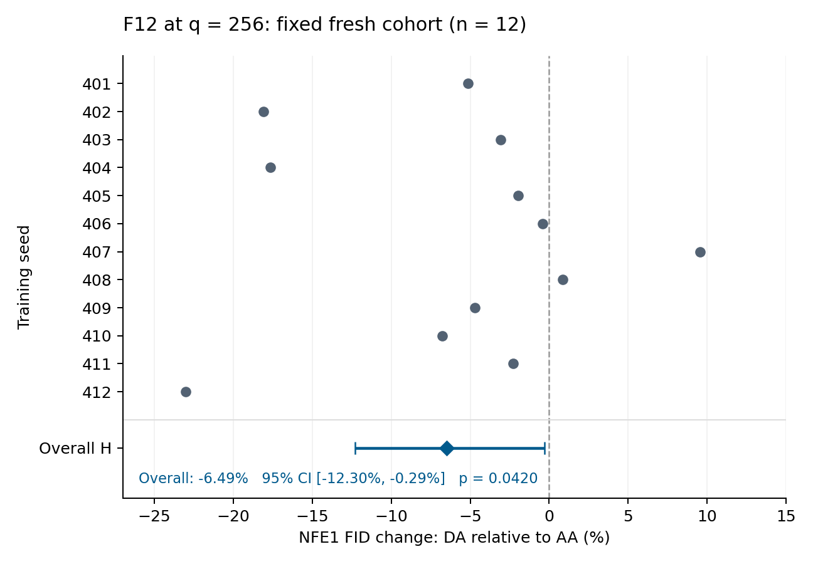

# F12@q256 完整12种子结果

**主效应 H：DA 相对 AA 的 NFE1 FID 降低 6.49%；95% CI [-12.30%, -0.29%]；双侧配对 t 检验 p=0.042024。** 预设单一主检验达到 alpha=0.05。

全部12个固定种子401–412、48条轨迹和288个generation blocks均完成并PASS；没有剔除或替换种子，没有启动413–416。H的区间上界接近零，效应精度仍有限。M/C/S的Holm校正p均为0.052463，均未达到0.05阈值。

## 四臂指标

每路径3个50000样本block。FID按预设log尺度聚合，下表为12种子的几何均值。KID为冻结流水线原始数值的算术均值。NFE2和KID仅描述，不进行显著性检验。

| 路径 | NFE1 FID | NFE1 KID | NFE2 FID | NFE2 KID |
|---|---:|---:|---:|---:|
| AA | 8.8804 | 0.0054357 | 2.8515 | 0.0009457 |
| DA | 8.3045 | 0.0050208 | 2.7960 | 0.0009255 |
| A↓5 | 8.2087 | 0.0049235 | 2.7855 | 0.0009172 |
| D↑5 | 8.9494 | 0.0054540 | 2.8704 | 0.0009746 |



图中整体 H 为先平均种子 log 差、再指数变换的结果，横线为种子级配对 t 的95% CI；不是逐种子百分比的算术平均，也不把 generation block 当作训练重复。[PDF](paired_H.pdf) 可用于排版；`render_figure.py` 可用 Matplotlib 3.10.6 重画。

## 预指定统计对比

| 对比 | log-FID估计 | 变化/效应 | 名义95% CI | 双侧p | Holm p |
|---|---:|---:|---|---:|---:|
| H | -0.067054 | -6.49% | [-12.30%, -0.29%] | 0.042024 | N/A |
| M | -0.078650 | -7.56% | [-13.73%, -0.96%] | 0.029054 | 0.052463 |
| C | +0.074787 | +7.77% | [+1.40%, +14.53%] | 0.020491 | 0.052463 |
| S | +0.076718 | +0.07672 log | [+0.01626, +0.13717] log | 0.017488 | 0.052463 |

H=DA−AA；M=A↓5−AA；C=D↑5−DA；S=(C−M)/2。M/C/S区间是名义区间，未作同时区间校正，族内结论以Holm p为准。S不是某个模型的FID改善百分比。

H的90% log CI为[-0.119409, -0.014699]，未完全落在±log(1.03)等价带内；TOST p=0.887602，未建立实用等价。完整病例n=12，可用配对敏感性也为n=12，估计与主口径一致。

## 逐种子NFE1 FID

10/12个种子的DA低于AA。所有种子均保留。

| 种子 | AA | DA | A↓5 | D↑5 | DA相对AA |
|---|---:|---:|---:|---:|---:|
| 401 | 7.6830 | 7.2885 | 7.6129 | 8.3336 | -5.14% |
| 402 | 9.2429 | 7.5720 | 7.6149 | 8.9014 | -18.08% |
| 403 | 10.7154 | 10.3871 | 10.3865 | 10.9119 | -3.06% |
| 404 | 9.0889 | 7.4842 | 7.2420 | 9.9055 | -17.66% |
| 405 | 7.8936 | 7.7395 | 7.2451 | 7.8602 | -1.95% |
| 406 | 8.0146 | 7.9803 | 7.5749 | 7.8655 | -0.43% |
| 407 | 7.1902 | 7.8768 | 7.6144 | 7.3756 | +9.55% |
| 408 | 9.0573 | 9.1354 | 9.4040 | 8.8343 | +0.86% |
| 409 | 8.3718 | 7.9768 | 7.7282 | 8.5461 | -4.72% |
| 410 | 7.8998 | 7.3654 | 7.3977 | 8.1039 | -6.77% |
| 411 | 9.9177 | 9.6905 | 9.9842 | 10.4099 | -2.29% |
| 412 | 12.8705 | 9.9101 | 9.5702 | 11.3345 | -23.00% |

## 完成性与工程记录

| 臂 | 训练PASS | NFE1 blocks PASS | NFE2 blocks PASS | 终态失败 | AMP skips |
|---|---:|---:|---:|---:|---:|
| AA | 12/12 | 36/36 | 36/36 | 0 | 155 |
| DA | 12/12 | 36/36 | 36/36 | 0 | 156 |
| A↓5 | 12/12 | 36/36 | 36/36 | 0 | 155 |
| D↑5 | 12/12 | 36/36 | 36/36 | 0 | 152 |

前10次成功更新时钟和实际LR窗口均为48/48通过；累计AMP skips=618，skip未推进成功更新时钟。D/A首个公共成功更新的范数比范围为[0.909067, 0.909120]，12/12满足0.90909±0.1%的相对容差，且批次、t和基础r的输入哈希均匹配。512 kimg切换前后共96份完整状态快照哈希已归档。

**范数和方向预期未全部出现：A↓5前五步范数和降低为10/12，D↑5升高为11/12。** 反向个例为A↓5的401、407和D↑5的405。开跑前冻结的《PREREGISTRATION_ZH.md》“开跑前修订说明”第3条明确：范数方向是附录观察项，不作为排除标准。因此没有据此删种子；实际LR与时钟核对结果如上。

两个原评估控制器曾在生成样本前因共享GPU被其他任务占用而退出。原日志和预启动导出保留；种子401的24个评估块随后用原checkpoint在后续评估资源完成。没有重跑训练、丢弃已完成评估块或终止无关用户进程。另有六条尚未开始的AutoDL第二路径因用户预算安排迁移至后续评估资源；科学配置不变。

## 流程披露与结论边界

期间按用户明确要求进行过一次提前查看：117个NFE1 blocks、7个完整四臂种子。该快照单独留档。后续没有根据它修改种子、训练、对比、追加规则或停止条件；本报告使用完整12种子及原冻结分析函数。研究报告需披露这次流程偏离。

本结果支持该CIFAR-10/DDPM++、q=256配置下的H负向效应，与C14方向一致。它不自动确证启动干预族，不证明机制唯一，也不从q128/q256各自是否显著推断spacing交互。

## 计算用量与归档状态

记录的训练进程用量为207.658 GPUh，评估为40.597 GPUh，预启动工程检查为0.179 GPUh，合计248.434 GPUh。此为进程GPU小时口径，不等于平台账单；未计空闲等待、传输及未使用的实例GPU配置。

科学计算、最终分析和数据回传均已完成。中央归档已验收332个不可变单元，覆盖4304个唯一文件、499.81 GB，并保留8份完整源端导出及2份先前退租的归档证明。最后四台云实例由用户确认释放，资源跟进和桌面通知已停止；未独立核验平台账单。中央归档及原始记录继续保留，详见 [archive_closeout.json](archive_closeout.json)。

## 复算与来源

在仓库根目录运行（CPU，Python 3.11+、NumPy、SciPy）：

```bash
python -m pip install -r results/q256_response_unselected_fresh12_v1/requirements-reproduce.txt
python results/q256_response_unselected_fresh12_v1/reproduce.py
```

脚本从288行 block 指标重建12个种子的 log-FID，复算已冻结的 H/M/C/S、Holm 和 H 的 TOST，核对完成性、工程表、资产身份与公开文件 SHA256。它不启动训练、生成图片或重新解盲。科学训练环境是 Python 3.11.13 / PyTorch 2.6.0+cu124 / CUDA 12.4 / NumPy 2.1.2 / SciPy 1.16.1。

- [statistics.json](statistics.json)：冻结输出的公开投影，保留全部统计值；重复表单独提供。
- [per_seed.csv](per_seed.csv)、[per_seed_fid.csv](per_seed_fid.csv)：逐种子 log-FID/对比与几何 FID。
- [blocks.csv](blocks.csv)：288块 FID/KID、生成种子范围、评估器、checkpoint/feature/原收据 SHA256。FID 数值保持原样；移除机器绝对路径，增加经原收据核对的评估元数据。
- [completion.csv](completion.csv)、[failure_counts.csv](failure_counts.csv)：终态完成性与失败计数；前述评估控制器预启动中断另行披露，不抹除其历史。
- [engineering_summary.json](engineering_summary.json)、[engineering_paths.csv](engineering_paths.csv)、[engineering_pairs.csv](engineering_pairs.csv)、[switch_snapshot_hashes.csv](switch_snapshot_hashes.csv)：工程汇总、48路径、12配对和96份切换快照。
- [descriptive.json](descriptive.json)：四臂 NFE1/NFE2 描述统计与进程 GPUh。
- [interim_disclosure.json](interim_disclosure.json)：一次提前查看的时间、原快照哈希及当时的 H；不把本次运行描述为全程无期中查看。最终 p 值使用冻结的固定样本检验，未作顺序检验校正。
- [VALIDATION.md](VALIDATION.md)：复算范围、实际差异与解释边界。
- [frozen/PREREGISTRATION_ZH.md](frozen/PREREGISTRATION_ZH.md)、[frozen/analysis.py](frozen/analysis.py)、[frozen/protocol.py](frozen/protocol.py)、以及 [worker.py](frozen/worker.py)、[evaluation.py](frozen/evaluation.py)：来自科学提交的逐字节原件，仅作审计快照；完整旧训练依赖不由本结果 PR 安装。
- [frozen/source_freeze.json](frozen/source_freeze.json)、[PROVENANCE.json](PROVENANCE.json)：开跑前334文件哈希、运行环境、原件哈希与公开投影说明。
- [PUBLIC_SHA256SUMS.txt](PUBLIC_SHA256SUMS.txt)：本目录的便携校验清单。

科学冻结 Git 标识为 `9d1ecc519d91d36d76bf1089d2800e8fea92ce62`，源码归档 SHA256 为 `72ff265065ddbc778ee1bf4747e1ed57e39e9f3f3c91e6ff1589e7b86d84ca44`；评估器提交为 `d6aba02fb88e9db0993623895eb2228ed717d810`。此处 Git 标识是部署来源记录，不保证该历史提交可在本 PR 的 main 分支上直接检出。预注册文档 SHA256 为 `5e14b2d836b32605bcc7d898cb6642b7e7b9af02fc8a03c9872b72f0c6913e15`。

原始 checkpoint、生成数组、全部源端日志与部署收据保留在中央归档。本目录公开了轻量指标、工程表和原件哈希；不等同于公开了全部原始数据，也不宣称训练已在另一环境独立复现。
