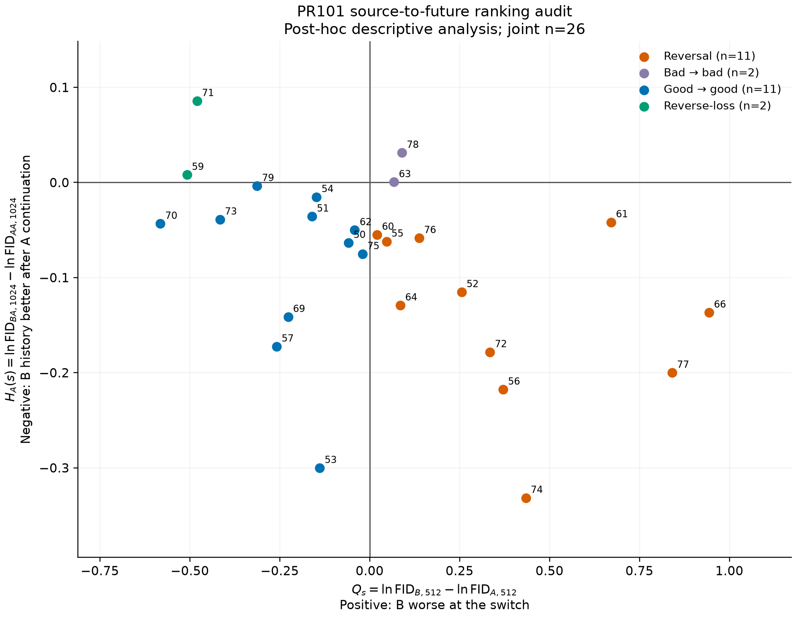

# PR101 512-kimg source-to-future ranking audit

This is a post-hoc source-quality backfill and structural audit. No new training was performed. The frozen PR101 primary verdict is unchanged; this analysis was not its preregistered primary endpoint.

## Cohort and evidence

- Source-valid A/B@512 pairs: 29.
- Formal jobs: 58; PASS / FAILED / NOT_RUN: 58 / 0 / 0.
- Source pairs with complete finite FID/KID: 29.
- Joint source plus frozen AA/BA@1024 cohort: 26.
- Source exclusions: [{'seed': 67, 'arm': 'A', 'reason': 'RuntimeError: MISSING_512_SOURCE_STATE'}].
- Valid source pairs without a complete frozen endpoint: [58, 65, 68].
- Evaluation failures: [].

Source inclusion used only the retained A/B@512 states. All selected full-state file hashes, 512000-image / 4000-attempt counters, seed and factorial identity, EMA finiteness, internal hashes, and telemetry were verified on ECT002 before freezing. Extracted source receipts were unreadable to ECT002, so their copies were read from the historical audit tar after verifying its recorded SHA256. This permission limitation did not remove a seed.

The unchanged evaluator, detector, and real-feature bytes are bound by protocol hashes. Dataset-path cache aliases preserve the frozen real-feature bytes. Each evaluation uses sample IDs 0–49999, metric seed 20260730, NFE1 and FP32. FID50k and KID50k share generated features, with equality checked by SHA256. The integrity seal predates scalar decoding.

## Source-quality descriptive summary

Q = ln(FID_B@512) − ln(FID_A@512); positive Q means B has worse source FID.

| Statistic | Value |
|---|---:|
| n | 29 |
| Mean Q | -0.018975318 |
| Median Q | -0.041471524 |
| Sample SD | 0.44977287 |
| 95% Student-t CI for mean Q | [-0.19005977, 0.15210913] |
| Q > 0 | 13 |
| Q < 0 | 16 |
| Q = 0 | 0 |

## Source-to-future descriptive comparison

H_A = ln(FID_BA@1024) − ln(FID_AA@1024), using the frozen PR101 complete endpoint file. Both scalars independently reproduce its stored contrast. The join uses actual seed overlap; no joint sample size was imposed.

Joint Q>0: 13/26. Joint H_A<0: 22/26. Delayed reversals: **11/26**.

| Source ordering | H_A < 0 | H_A > 0 |
|---|---:|---:|
| Q > 0 | 11 reversal | 2 bad → bad |
| Q < 0 | 11 good → good | 2 reverse-loss |

On-axis observations: 0. Exact ties are retained separately, without an epsilon relabeling rule.

Pearson(Q,H_A): -0.45701643. Spearman(Q,H_A): -0.48717949. These correlations are descriptive. No confirmatory correlation test or causal regression was performed.

## Interpretation boundary

Within the PR101 q256 cohort, one-step FID at 512 kimg does not always preserve the ordering of downstream continuation value. Some enlarged-spacing histories that are worse by FID at the switch later yield better final quality under the same native-spacing continuation.

The result is restricted to this PR101 cohort and available complete joint observations. It does not establish general FID unreliability, systematic misranking, or a causal effect of source FID on future quality. PR95/97/101 were not pooled into an unplanned confirmatory p-value. Missing endpoints are reported rather than used to exclude valid sources.

## Measured compute

- Formal A100 GPUh: 2.790184.
- Smoke A100 GPUh: 0.000000.
- Total evaluation A100 GPUh: 2.790184.
- Formal matrix wall time: 2697.540 seconds (0.749317 hours).
- Accounting: Sum of elapsed seconds while each evaluation attempt held one exclusive GPU; includes generation and metric computation, excludes CPU inventory/export/transfer.

The scalar CSVs independently reproduce Q, the join, and the quadrant table. Protocol SHA256: `87b51a7383c67772cdbc1f96ef1bda3766af233995c41f2b36ce57ba1abcad72`. Final packaging and ECT002 return verification are recorded separately after this report is sealed.

## Execution amendments and release preparation

Smoke was NOT_RUN_USER_WAIVED before formal results. Source SHA verification was completed during inventory. Each consumed snapshot passed its input hash and EMA binding check before generation; the reused evaluator checked shared FID/KID feature hashes. Repeated bulk binary hashes at the seal were omitted under the budget waiver.

Eight already received full states were exported on A100; fifty source snapshots were exported on ECT002. Input-readiness races (receipt arrival before snapshot completion and initially non-atomic JSON completion delivery) interrupted only untouched jobs. Atomic completion markers and exclusive job directories resolved the scheduling issues. No scientific job was repeated, no sample block added, and no seed replaced. Original error logs and recovery scripts are retained.

The user subsequently requested release of the A100 instance. Generated samples/features and consumed exported snapshots are therefore also returned and hash-verified under the ECT002 archive's raw_evaluation_artifacts directory. Raw-backup completion, compact-package remote SHA verification, and a new results PR are required before release. Original source checkpoints remain in the original ECT002 archive.

The final archive timing receipt separately records preparation and return delays. Evaluation GPUh measures exclusive evaluation occupancy, not rental billing.
